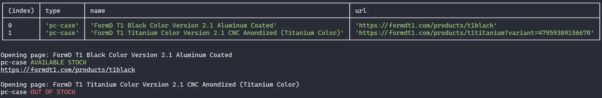

# Stock Notifier



## Description

The Stock Notifier is a terminal application that allows users to search for specific items and receive desktop notifications when those items are available. It provides a convenient way to stay updated on stock availability without constantly checking websites manually.

## Features

- Searches for one or multiple items at online shops
- Notifies user with desktop notification
- Customizable json file

## Usage

1. Clone the repository.
2. Install the dependencies.

```sh
npm install
```

3. Modify `settings.json` with desired [configuration](#configuration).
4. Run the application.

```sh
npm run start
```

## Configuration

The `settings.json` file contains the configuration for the application. The file is structured as follows:

```json
{
  "enableNotifications": true,
  "interval": 300,
  "items": [
    {
      "name": "Example",
      "type": "example-type",
      "url": "https://example.com",
      "selector": "#id",
      "content": "Example text",
      "notify": true
    }
  ]
}
```

- `enableNotifications`: Enable desktop notifications
- `interval`: Search interval (in seconds)
- `items`
  - `name`: The name of the item.
  - `type`: Some groupable type for display purposes.
  - `url`: The URL of the item.
  - `selector`: CSS selector of the item to search (ex. add to cart button).
  - `content`: The interval in seconds between searches.
  - `notify`: If _true_ sends desktop notification when an item is available

## License

This project is licensed under the [MIT License](LICENSE).
